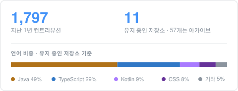
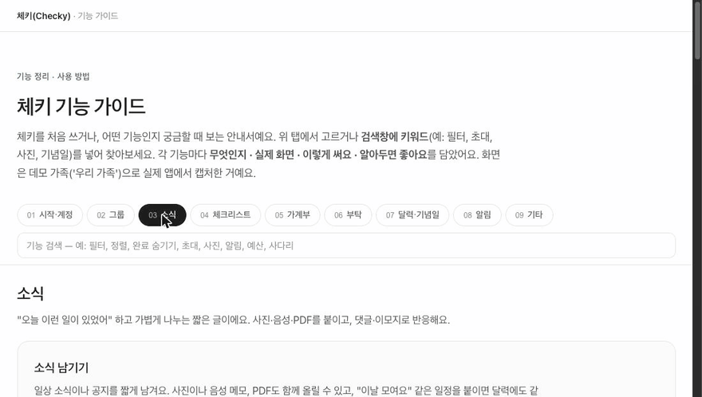

<table>
<tr>
<td valign="top" width="50%">

### 박진형 · secretj

**백엔드 개발자**

평일에는 그룹웨어 메일 서비스 서버를 다루고,
그 밖의 시간에는 직접 만든 앱 두 개를 운영한다.

혼자 만드는 쪽이라 서버부터 화면, 배포까지 다 잡는다.
고친 건 테스트로 남기고, 애매하게 고른 건 이유를 적어 둔다.

Seoul · [@mailplug-inc](https://github.com/mailplug-inc)

</td>
<td valign="top" width="50%">

</td>
</tr>
</table>

<table>
<tr><td><b>서버</b></td><td>

</td></tr>
<tr><td><b>앱 · 프론트</b></td><td>

</td></tr>
<tr><td><b>운영</b></td><td>

</td></tr>
</table>

 

## 만들고 있는 것

<table>
<tr>
<td width="76" valign="top" align="center"></td>
<td valign="top">

**체키** · [hichecky.com](https://hichecky.com) · [기능 가이드](https://hichecky.com/guide/checky-guide.html)

가족이나 친구끼리 쓰는 그룹 앱. 소식 남기고, 체크리스트 같이 쓰고, 가계부와 집안일을 나눠 관리한다.
카드 결제 알림을 읽어서 가계부에 넣어주고, 기념일은 1주 전에 알려준다.

`Java 21` `Spring Boot 3.4` `MariaDB` `Flyway` `React 18` `TypeScript` `Vite` `Docker Compose` `Cloudflare Tunnel`

</td>
</tr>
</table>

<table>
<tr>
<td width="76" valign="top" align="center"></td>
<td valign="top">

**품앗이** · Google Play 비공개 테스트

축의금, 부의금 기록하는 안드로이드 앱. 서버에 올리지 않고 폰에만 저장하고, DB는 암호화해 둔다.
연락처에서 이름 가져오기, 결제 알림으로 금액 채우기, 기프티콘 사진 인식이 들어 있다.

`Kotlin` `Jetpack Compose` `Room` `SQLCipher` `Android Keystore` `Play Billing`

</td>
</tr>
</table>

 

## 그 외

| | |
|---|---|
| **[promptfit](https://github.com/secretj/promptfit)** | 써 둔 프롬프트를 claude.ai / ChatGPT / Claude Code 각 환경에 맞는 파일로 뽑아 준다 · `Astro` `Cloudflare Pages` `D1` |
| **[ot-job](https://github.com/secretj/ot-job)** | 서울 작업치료 채용 공고를 긁어서 카카오톡으로 보내 준다 · `Python` `Flask` `APScheduler` |
| **[Lien](https://github.com/secretj/Lien)** | JWT 인증 붙여 본 프로젝트 · `Spring Boot` `Spring Security` `Redis` `MySQL` |
| **[Discord-pubg-bot](https://github.com/secretj/Discord-pubg-bot)** | 배그 랭크 보고 디스코드 역할 자동으로 바꿔 주는 봇 · `Kotlin` |
| **[secretj-claude-config](https://github.com/secretj/secretj-claude-config)** | 내 Claude Code 설정 (skills / hooks) |
