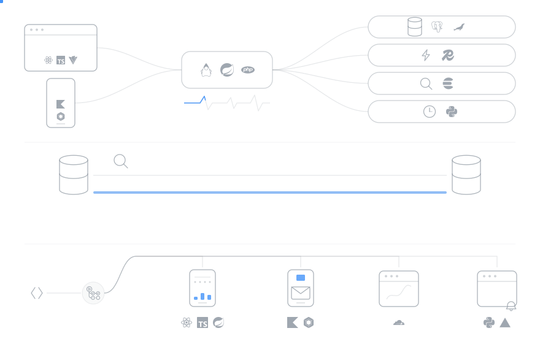

<h1 align="center">박진형</h1>

  운영 중인 메일 서비스를 고치는 백엔드 개발자입니다. 
  필요한 앱은 직접 만들어 혼자 운영합니다. 서버 구성부터 배포까지 전부요.

  

 

## 회사

<table>
<tr>
<td valign="top">
<b>메일 서비스 백엔드</b> 
운영 중인 기능 수정과 장애 대응 · 데이터 이관과 이관한 뒤 원본 대사 · 대량 발송·수신 처리 · 정해진 시간에 도는 작업  

</td>
</tr>
</table>

## 혼자 만든 것

<table>
<tr>
<td width="50%" valign="top">
<a href="https://hichecky.com"><b>체키</b></a> 
공동 가계부, 공동 캘린더 등 예산관리 PWA APP  

 
<a href="https://hichecky.com">hichecky.com</a> · <a href="https://play.google.com/store/apps/details?id=com.hichecky">Google Play</a>
</td>
<td width="50%" valign="top">
<a href="https://play.google.com/store/apps/details?id=com.gyeongjosabi.note"><b>품앗이</b></a> 
경조사비 장부 NATIVE APP  

 
<a href="https://play.google.com/store/apps/details?id=com.gyeongjosabi.note">Google Play</a>
</td>
</tr>
<tr>
<td width="50%" valign="top">
<a href="https://trip.hichecky.com"><b>여행 일정표</b></a> 
개인적인 여행 계획을 기록하는 웹  

 
<a href="https://trip.hichecky.com">trip.hichecky.com</a>
</td>
<td width="50%" valign="top">
<a href="https://github.com/secretj/ot-job"><b>ot-job</b></a> 
작업치료 채용 공고를 모아 카카오톡으로 알리는 웹  

 
<a href="https://github.com/secretj/ot-job">저장소</a>
</td>
</tr>
<tr>
<td width="50%" valign="top">
<a href="https://github.com/secretj/secretj-claude-config"><b>secretj-claude-config</b></a> 
Claude Code 설정 — 에이전트, 커맨드, 스킬, 훅, MCP 템플릿  

 
<a href="https://github.com/secretj/secretj-claude-config">저장소</a>
</td>
<td width="50%" valign="top">
<a href="https://github.com/secretj/Lien"><b>Lien</b></a> 
JWT 인증 서버  

 
<a href="https://github.com/secretj/Lien">저장소</a>
</td>
</tr>
</table>
