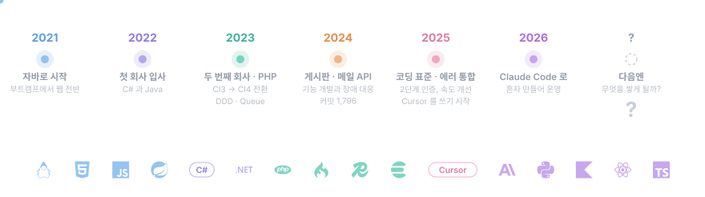

  웹 백엔드 개발자로 일하고 있습니다. 
  서비스의 전체 흐름을 설계하고, 사용성이 좋은 '편한 앱'을 만들기 위해 노력하고 있습니다. 
  최근에는 AI를 활용하여 더 다양한 도전을 하고 있습니다.

  

 

## 회사

<table>
<tr>
<td valign="top">
<b>메일 서비스 백엔드</b> 
운영 중인 기능 수정과 장애 대응 · 데이터 이관과 이관한 뒤 원본 대사 · 대량 발송·수신 처리 · 정해진 시간에 도는 작업  

</td>
</tr>
</table>

## 현재 운영 중인 개인 프로젝트

<table>
<tr>
<td width="50%" valign="top">
<a href="https://hichecky.com"><b>체키</b></a> 
공동 가계부, 공동 캘린더 등 예산관리 PWA APP  

 
<a href="https://hichecky.com">hichecky.com</a> · <a href="https://play.google.com/store/apps/details?id=com.hichecky">Google Play</a>
</td>
<td width="50%" valign="top">
<a href="https://play.google.com/store/apps/details?id=com.gyeongjosabi.note"><b>품앗이</b></a> 
경조사비 장부 NATIVE APP  

 
<a href="https://play.google.com/store/apps/details?id=com.gyeongjosabi.note">Google Play</a>
</td>
</tr>
<tr>
<td width="50%" valign="top">
<a href="https://trip.hichecky.com"><b>여행 일정표</b></a> 
개인적인 여행 계획을 기록하는 웹  

 
<a href="https://trip.hichecky.com">trip.hichecky.com</a>
</td>
<td width="50%" valign="top">
<a href="https://github.com/secretj/secretj-claude-config"><b>secretj-claude-config</b></a> 
Claude Code 설정 — 에이전트, 커맨드, 스킬, 훅, MCP 템플릿  

 
<a href="https://github.com/secretj/secretj-claude-config">저장소</a>
</td>
</tr>
</table>
