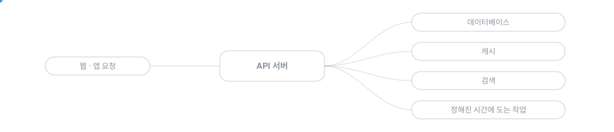
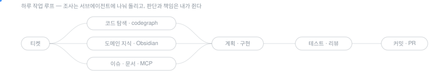
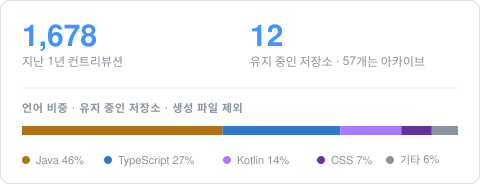

### 박진형 · secretj

안녕하세요, 박진형입니다.

2021년 여름에 Java 교재를 한 장씩 따라 치면서 챕터마다 저장소를 하나씩 만들었어요. 그때 만든 것들이 아직 그대로 남아 있습니다.

지금은 사람들이 실제로 쓰는 서버를 맡고 있습니다. 회사에서는 이미 돌아가고 있는 서비스를 고치고 옮기고, 퇴근하면 가까운 사람들이 쓸 앱을 만들어 직접 운영합니다. 하다 보니 만드는 시간보다 멈추지 않게 지키는 시간이 훨씬 길더라고요.

새로 만드는 것도 재밌지만, 오래 남는 걸 잘 만드는 사람이 되고 싶습니다.

 

## 하는 일

- 이미 돌아가고 있는 서비스를 고치고, 멈추지 않게 지킵니다
- 데이터가 어디에 어떻게 쌓일지 정하고, 느려지면 원인을 찾습니다
- 사람이 보지 않는 시간에도 돌아야 하는 작업을 만듭니다
- 쌓인 데이터를 다른 곳으로 옮기고, 옮긴 뒤에 맞는지 하나씩 맞춰 봅니다
- 문제가 생기면 원인을 찾을 때까지 들여다봅니다
- 혼자 하는 프로젝트에서는 서버부터 화면, 배포까지 전부 직접 합니다

 

## 작업 방식

- 할 일 하나를 받으면 찾아보고 → 계획하고 → 고치고 → 확인하고 → 올립니다. 매번 같은 순서로 합니다
- 코드를 고치기 전에 어디까지 영향이 가는지 먼저 봅니다
- 찾아보는 일은 여러 갈래로 나눠 동시에 돌리고, 나온 결과는 직접 확인한 뒤에 씁니다
- 작업하다 알게 된 건 메모로 남겨 둡니다. 다음에 같은 걸 또 찾지 않으려고요
- 자주 하는 일은 Claude Code 커맨드로 묶어 두고, 커밋 전 점검도 자동으로 걸어 둡니다
- 쓰는 설정은 [secretj-claude-config](https://github.com/secretj/secretj-claude-config)에 올려 뒀습니다

 

## 쓰는 것

<table>
<tr><td><b>서버</b></td><td>

</td></tr>
<tr><td><b>앱 · 프론트</b></td><td>

</td></tr>
<tr><td><b>운영</b></td><td>

</td></tr>
<tr><td><b>작업 환경</b></td><td>

</td></tr>
</table>

 

## 지금까지

